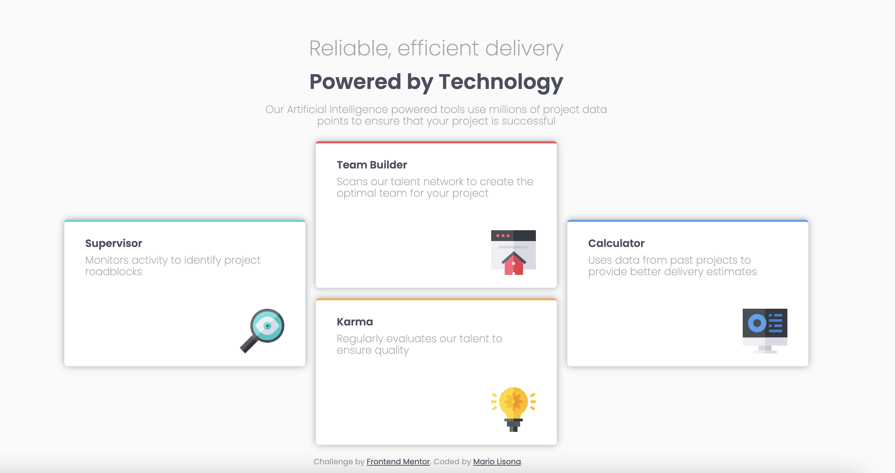
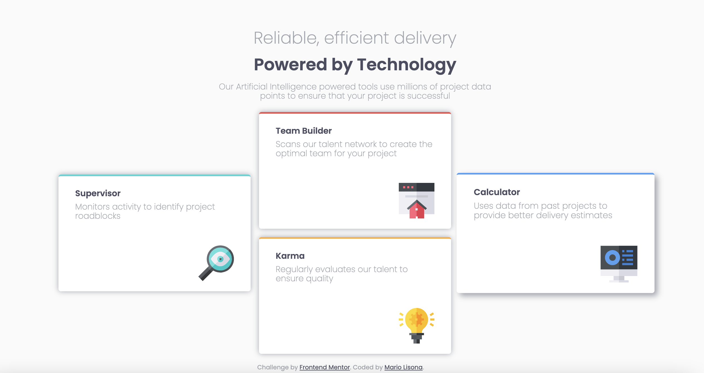
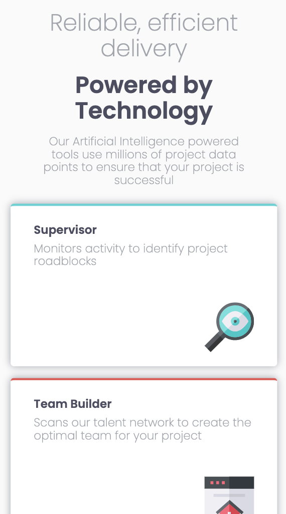
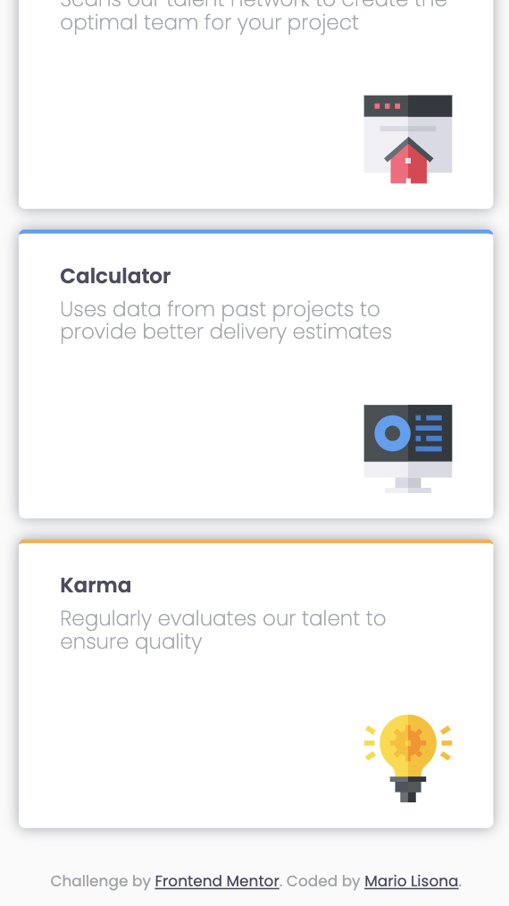
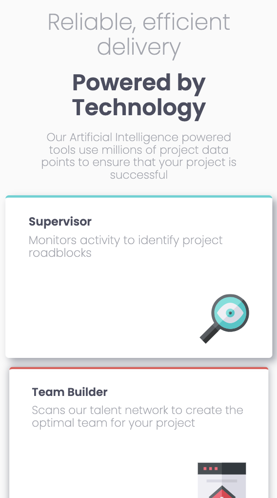

# Frontend Mentor - Four card feature section solution

This is a solution to the [Four card feature section challenge on Frontend Mentor](https://www.frontendmentor.io/challenges/four-card-feature-section-weK1eFYK). Frontend Mentor challenges help you improve your coding skills by building realistic projects. 

## Table of contents

- [Overview](#overview)
  - [The challenge](#the-challenge)
  - [Screenshot](#screenshot)
  - [Links](#links)
- [My process](#my-process)
  - [Built with](#built-with)
  - [What I learned](#what-i-learned)
  - [Useful resources](#useful-resources)
- [Author](#author)

**Note: Delete this note and update the table of contents based on what sections you keep.**

## Overview

### The challenge

Users should be able to:

- View the optimal layout for the site depending on their device's screen size

### Screenshot

### Links

- Solution URL: [Add solution URL here](https://github.com/MarioLisbona/FEM-four-card-feature)
- Live Site URL: [Add live site URL here](https://mariolisbona.github.io/FEM-four-card-feature/)

## My process
I created the main container and used CSS grid to create a 3x3 grid. I filled the top row with the title information. The bottom left two rows i filled with the Supervisor card, and used `justify-self: flex-end` to bring the card towards the center two cards. I did the oposite for the Calculator card, using `justify-self: flex-start` to align the card towards the center.

I styled each car using flexbox and a .card class with all the common features. I then used .supervisor, .calculator, .karma and .team-builder classes to style each individual card.

### Built with

- Semantic HTML5 markup
- CSS custom properties
- Flexbox
- CSS Grid

### What I learned

I continued to practice using CSS grid to layout all the elements on this page.

### Useful resources

- [Example resource 1](https://courses.webdevsimplified.com/) - This website helped me get comforatable with using CSS Grid.

## Author

- Frontend Mentor - [@MarioLisbona](https://www.frontendmentor.io/profile/MarioLisbona)